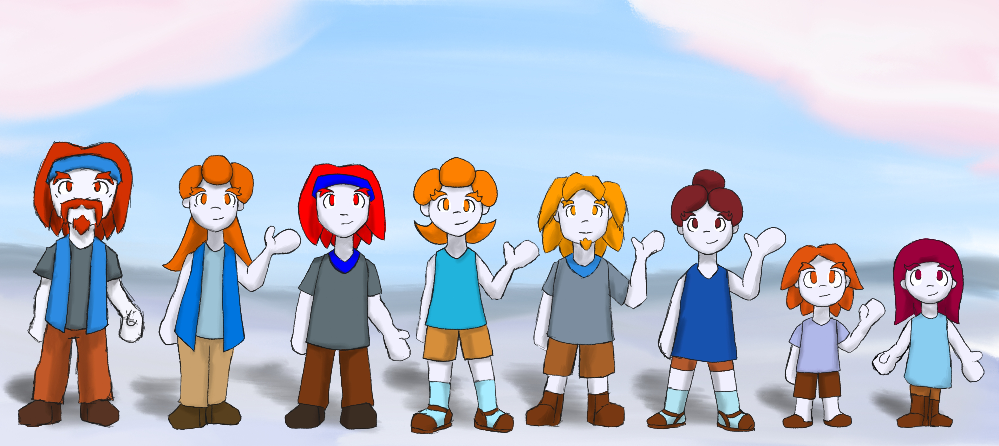

# Imoh

In the World of Threa, there are 21 races. This is a description of a race that lives in the world of Threa, the Imoh. That I will describe

---

---

The Imoh are a simple patriarchal tribal society.  they are nearly isolated from the rest of the Threa due to living on the other side of an impassable mountain range, and encircled by harsh, unnavigable water  

---

An interesting property of the Imoh is that their comfort level in regard to temperature is lower than average. even in freezing cold temperature, they may just feel a bit chilly. As such, their clothing appears more suited for a hot summer rather than the cold environment they live in. sandals, shorts, and short sleeve shirts. because their normal room temperature is below freezing, and actual room temperature setting would be hot for them.

---

Their societal structure is simple. They are organized in tribes, with a single elder governing the tribe. The elder is always male. His wife can provide counsel if needed. It is the elder who chooses their successor. and they decide when they will retire. if an elder passes without a successor. The eldest person in the tribe becomes the elder. However, they may deem themselves too old to govern so they name a successor and retire immediately. Some individuals do try to curry favor with the elder so they may be chosen but it never works. Their buildings are igloo style. The outer domes are built of compacted snow, more space is achieved by having the main compartments below ground level. Their farming is unique since they live in a vast field of snow. They first need to uncover the ground to plant seeds. After seeding, they build structures with compact snow to cover the entire field protecting the plants from the cold. they mark the spot of the field. When ready to harvest they locate and uncover the field. They harvest mainly berries and other useful plants. they are also expert fishers. They break the ice over frozen water and fish. They very easily get large catches, but they only take what they need. Because of their isolation, there really isn't much conflict. There is plenty of space for the tribes for their use. They have no military or police. they do have martial competitions for entertainment, with the nunchuk as their weapon of choice. they hold various festivities, competitions, and meditative sessions. inter tribals interaction is ecurage. many families are mix tribe families. 

---

Below the thick layers of snow and ice there is fertile soil, and clean water. They have wells to reach that water. The roots of their crops cut thru the snow and ice to reach the soil beneath. Their farm fields are about a yard or two deep, and the roots still have ways to go. Where it possible to remove all that buildup of snow, there would be a complex river delta. 

---

another idea for the Caribbean arctic, coconut bushes. there are wild coconut bushes buried under the snow. the imoh know where they are, uncover them and help themselves to some coconuts. but the thing is that they are not bushes but trees, with tall, strong trunk, but buried under the snow. and it is still not tall enough to reach the soil, the fibrous roots work the rest of the way. 

i do want the berries to have long roots to reach the soil. while the snowfield covers fertile soil underneath, if the snow buildup is too thick, that is has compacted into ice, then it is not farmable snow. part of living there is knowing how to find farmable snow, where it is soft enough for the berry roots are able to cut thru. 

they can get fibers from the cocunut husk, plus the also farm cottonberries for fibers too.

---

ok, the southern snowfield is mostly flat, with some snow dunes and hills here and there, but no mountains. under all the snow is a river delta basin that has fertile soil. it is on average 7 stories thick, some areas are 10 stories thick. in some areas, the snow has compacted into ice near the soil level, so it is hard to notice at the surface level.  the farm field is dug about two stories below snow level. note, Imoh buildings are already one story deep, so the adjacent farm building is one story deep, while the field itself is two stories deep. and it is dug to open sky, not a cavern, to maximize sunlight during the seedling phase. berry and cottonberry seeds are sown into the farm field. when they germinate, their roots shoot downward, cutting thru the multiple stories of snow. if the snow is too hard, that it formed into ice, and this ice is too hard, too solid, then the roots wont reach the soil and fail to take root. it takes a some days, no more than a month, for the roots to reach the soil. throughout this time, the farmer has to tend the crop, provide nutrients while the root travels. once the roots reach the soil, the first leaves forms. this indicates the roots have taken hold. now the field is buried under snow. it is done in a structured manner so that light passes thru the translucent layers of snow and ice. at this point, the field requires minimal maintenance. only the ferret are the only pest to be worried about. once it is ready to harvest, the field is once again uncovered, let a day or so more of open sky sunlight, then the berries are harvested 

---

Regarding their appearance, they are relatively short at no more the 5' tall. they have snow white skin. Their hair and eyes are vibrant reds, oranges, and violet. They have bushy eyebrows. Male may grow mustaches. Their hands resemble mittens, one broad finger and a thumb. They have two toed feet. Their clothing selection includes sandals with socks, loafers, boots shorts, pants, short sleeve shirts, headbands. The elders wear a blue vest. Their pants, shorts, boots sandals and loafers tend to be brown, everything else can be white, light gray, or light blue, with some red trims. because of the comfortable shift in temperature, they feel comfortable wearing what looks like summer attire in freezing temperatures.

---

The Imoh live in near complete isolation, which means they have no military forces, and their tribes are small enough that policing is unnecessary. Therefore, they do not have any combat roles. However, they do uphold a martial tradition, which is more focused on meditation and demonstration matches rather than actual combat. These demonstration matches are individual performances rather than fights, and each is evaluated based on skill, composition, creativity, and precision, similar to a dance.

---

The weapon of choice of the Imoh are Chucks

Imoh produced chuck are not used in combat, rather for performance. still, they can technically be used in combat. but because of their isolation and peaceful environment, Imoh, produced chucks  have not been used in combat at all. they are built with soft woods and rope

chucks are produced in the rest of Threa, but not many. Since the isolated Imoh are the one that receive the affinity boost from using chucks, no one outside can take full advantage of the chucks. so armories in Threa find little reason to make chucks besides as a novelty weapons. nonetheless unlike Imoh produced chucks, armory produced chucks are capable weapons. If only could they be wielded by an Imoh to be used to their full potential. they are built with chains and hard woods or metals.

---

imoh buildings. their primary building material is compacted snow. their settlements are recognized by the dome igloos. however, their living space is not in the dome, for that is their ceilings. they living space is under the snow level. about one story below snow level, they dig out their living space, with the extracted snow used to make compact snow bricks that line their under snow walls and dome ceilings.  the entrance to their dwellings is a stairway near one of the domes the leads under them

---

the southern snowfield is a vast, snow covered prairie. on the northwestern side, there is a nearly impassible mountain range. referred to as blue mountains from the snowfield side of the range. for the rest of Threa, they are referred as Aurora Mountains. all other sides is surrounded by raging waters. the "coast" is actually a 10 story sheer cliff drop. the sea floor near the coast actually plunges into deep trenches. it is this network of trenches that make the water surrounding the snowfield fierce. besides the costal cliffs, the subglacial delta emerges and empties into the sea. where it emerges from under the snowpack, it has carved caverns, but who is willing to decend down there. 

---

Additionally, one other thing the snowpack hides are massive Rock Ice crystals. It's is a form of ice that behaves more like rock, even like marble. The Imoh themselves don't mine it. Outsiders do use it to supplement their buildings, but it erodes into snow outside the frigid climate. The important aspect is that some of these formations form a bowl, which holds water. These are the lakes and ponds that are basically suspended 10 stories of the ground, where it not the snowpack supporting it. Fresh water fish live inside bodies of water. While the lake is covered in normal ice, the Imoh can break thru this ice and fish there. 

---

the flora is scares, there are three varieties of plants, coconut bush, pinebush, and wild snowberries. it is the wild snowberry that is the progenitor of the cultivated snowberry and cottonberry,

the coconut bush is a short bush, it has broad laminar leaves and hardy, husk encased fruit, the coconut. they can get not only the fruit flesh and water, but also the husk can be used for fibers and for fire. the leaves can be used for oils, resin, and material. the branches make soft woods.

the pine bush is a taller bush, can even reach 5 ft tall above the snow level. it has needle like leaves. it has no nutritional value. but it is used for a harder resin, burning oils, material, and for their wood. pinebush is used to produce a red hardwood. or the hardest one native to the snowfield. outsiders bring stronger materials, including hardier woods.

the wild snowberry is a small flowering plant with a very long root. the plant produces a small fluffy light blue fruit. it is edible, but not to nutritious, and a bit bitter. it has two cultivated varieties, the snowberry and cottonberry. both have an even long root system. the snowberry produces colorful, sweet, and juicy berries clusters. its leaves are aromatic, the wildberry leaves also have a unique aroma. so they are used for teas and spices. the snowberry is a staple of Imoh cuisine.

the cottonberry pushed for the wild snowberry fluffiness to produces a nice pale blue fluffy bundle. it is not edible, but oil can be extracted. and the leaves make for a mild tea.

the two bushes are actually massive trees that are buried under the snowpack. the coconut bush is actually not tall enough, its roots start about 2 stories before they reach the delta soil. the pine bush is tall enough to start from the soil, and emerge 5 ft above the snowpack. at its base, the trunk diameter is about 10 ft. the wood close to the inaccessible base is very strong, but only the softer crown is available to be harvested.

the wild snowberry roots aren't long enough to reach the delta soil, so it make due with the limited nutrition it can get from the snow. the cultivated varieties are long enough to reach the fertile delta soil, giving them acces to rich nutrients.

---

The Imoh do use fire. it provides light, enables cooking, melts snow and ice, and keeps predators at bay. but because of their altered temperature perception, even a candle feels like bonfire, and thus cooking feels like a smelting furnace. so they have developed cooling gear. thick, multilayer garment that keep heat out and the cold in. while they can handle some everyday fire usage, it is uncomfortable, so the prefer to put on the insulating gear. during communal festivals, the cooks don the full heavy insulating gear, including the Imoh Parka. all the fires and ovens used to cook massive food for the festival makes the kitchen a hazard. good thing that the food rapidly cools in the frigid climate so they can eat it. traveling Imoh tend to have a cooling bowl. they fill the bowl with cold water, ice if available, and put the plate of food inside, since outsiders serve their food at least warm, if not hot. 

when they visit outsiders in the snowfield, since they keep their dweling warm with fireplaces, the imoh wear parkas to go inside the warm cabins, and take them off when they head out to the frigid outside

---

Fauna. note the Fauna design in Threa changes certain aspects of animals. "mammals" tend to be feathered, with other avian traits. and by avian, i also include dinosaurs. "birds" tend to be scaly, and "reptiles" may have fur. it isn't exclusive, there are "mammals" with fur, but feathered ones are more common. i will be enclosing the animal in quotes like "Bear". it just indicates the animal is bear like, it fills the bear role. thou the "Polar Bear" is feathered, has a hawk like beak, and its plumage resemble an emperor penguin. and talons for paws      
      
Domestic      
      
"Cat" [cats resemble owls, this one resemble snow owls] a fluffy, feathery  fluffball, that treads silently. its white feathers makes it hard to see in the white snow. good for pest control      
      
"Dog" [Dogs resemble roosters] loyal companions, with thick red and green plumage. they can sniff out fish in the frozen ponds      
      
"Wooly Swine" [this one is furred, and actually swine like, just with sheep's wool] wolly swine are their main cattle animal. good for meat and wool. Most are Grey blue, some have red spots.     
      
"Dog Horse" [like a great Dane, St bernard] this draft animal is used to pull sleds    
    
"falcon/tucan/songbird "  [a scaly bird, resembling a cobra.] great hunters and scouts. Require training to be a "falconer" they are fond of coconut, and and break the hardy husk. It's purple scales make it hard to spot when flying, if it were for the red tipped tail scales. It's hood helps it fly when the winds start to pick up. 

[note: irl animals don't really mean anything with the context of Threa. Saying a "cat" resembles an owl isn't useful. Being that "owls" exist, which is a furred, bat like bird.] 

---

additional notes. "emperor bear" mixes traits from polar bears and emperor penguins  while the "emperor bear" can keep up with a "dog horse" , the  "dog horse" can out maneuver and outlast them, just needs to avoid getting caught before that happens. on their first year, the father may stay with the pups, protect and feed them a bit. the young pups stay glued to the cliff's edge, worring about their mother for a month. by the fourth year, they know the mother would be fine, and roam a bit, but stay near the same spot. it is possible for a pup to fall, either they decide to jump or slip. they may not be strong enough to climb back. until the third year. 

"Emperor bear" down feathers are used in Imoh parka's, they are the best material. the "best" way to get them is while the pups are at the month long vigil. a first year father-abandoned pup would be the best. they have fresh down feathers. thou any pup before the black feather show is fine. now, the imoh only want the feathers, they dont want to harm the pup. outsiders however, may want a trophy to take home. lone patrolling males may deter some, but it could be that a pup is harmed. when the mother returns, and determines that her pup was hurt or worse, she may go on a revenge spree. she can track whatever scent she picks up. she can even delay the hibernation for a week, until her revenge is done. there are hunters that understand this revenge instinct and used it to lure the mother into a trap claim the her as a trophy, if they survive themselves

---

the " black tail snow ferret"

this "ferret" is a small, furred critter wit a long lithe body.  it white fur make is hard to be spotted, but its black tipped tail is a good cue to spot them. however, it isn't for nothing that they have the black tip. as the "ferret" can move as if its tail were its head. this helps confuse would be chasers, as it could move one direction, then move the other one. they can burry themselves in fluffy snow, and travel some distance, as long as the snow is fluffy.
 in the barren climate, it will eat anything digestible that fits in its mouth, but snowberries are its favorite. "snow cats" guard berry farms. their silent steps always catch a "ferret" nibling on some berries by suprise. good thing they can fain them. to get away

their maiting season is in the middle of winter. the black tip tail makes finding each other easier in white out conditions. the pups are born at the beginning of spring, when the storms "calm down" this approach give them as much time to grow hardy enough to survive their first winter.

ice ants are one of few insects that exist. they crawl along the trunks of the two bushes, deep beneath the snow pack. they carve out spaces between the trunk and the snow, and move nutrient, and bioluminescent light along the trees. the ferrets dive about 3 feet into the snow around a bush to snack on ice ants.

the "ferret" is related to the "common dark tail ferret" the populate throughout Threa. the winter coat of the "common ferret" is identical to the "snow ferret" , but while it is seasonal for the commom ferret, it is all year for the snow ferret. the winter coat does have a few varieties. the light fur can be off white, light grey or sheen white. while the tip may be dark grey, burnt brown and pitch black. the sheen white/ pitch black, royal contrast coat has significant value in the textile market of Threa. some hunters come to the snowfield thinking the year round availability would make it easier to catch this valuable pelt. some think that bringin in the common ferret into the snowfield would trick them and have their winter coat set in. but these ferrets aren't accustom to the frigid cold, so they dont survive, not even long enough for the winter coat to set in.

---

outsiders:

Blue Mountain is a NEARLY impassable mountain range, and encircled by harsh, NEARLY unnavigable water.  keyword is nearly. for the waters. outsiders have discovered a passage dubbed the blue week. once a year, for about one week, near the end of autumn, a narrow stream on the sea is calm enough to not break ships. outsiders have used this corridor to establish a foothold on the southern snowfield. they have established Blue Hold Port Town.

---

Ages ago, some intrepid explores where pass thru the impassable aurora mountains, first contact with the Imoh, yadda yadda. Further exploration led to the discovery of rare ores and gems in the snowfield side of the Aurora mountains, blue mountains. Transporting the ore and gems thru the mountain pass proved impractical. Think the crossing of the Alps but worse. So explores were sent to discover a passage around. Eventually, the sea corridor was discovered. Blue Hold was established. But as if it were a cosmic test of greediness, Blue Hold is pretty much across the other side of the snowfield from the mine, Coldstone. The long ardurous Frost Rush trail was established to connect Coldstone and Blue Hold

---

Blue hold is an impressive feat of engineering. It is made of three parts. The dock, steps and warehouse. To even build the dock, they had to tear down the cliff face that was sitting on it. Two ships, filled with nothing but fuels, we're set ablaze and crashed into the cliffs. The intense heat of the two fireballs weakened and melted the snowpack. Eventually, it gave in and the cliff face came crushing down to the sea. This created some space at the shore that eventually became the dock. 
Yes, "emperor bear" pup were in their vigil when the cliffs crashed down. And yes, three mama bears boarded two ship of that fleet on their revage spree. Both ships were, one mama bear survived. 

---

Blue hold is an impressive feat of engineering. It is made of three parts. The dock, steps and warehouse. To even build the dock, they had to tear down the cliff face that was sitting on it. Two ships, filled with nothing but fuels, we're set ablaze and crashed into the cliffs. The intense heat of the two fireballs weakened and melted the snowpack. Eventually, it gave in and the cliff face came crushing down to the sea. This created some space at the shore that eventually became the dock.         
Yes, "emperor bear" pups were in their vigil when the cliffs crashed down. And yes, three mama bears boarded two ships of that fleet on their revenge spree. Those ships had builders, materials, and a few ranking members. Both ships were lost with all hands, one mama bear survived. The new coast surface actually helped her survive. She could not have made the climb in her state. She rested on the new shore, halting any construction plans. No one dared going on land while she was there. Eventually she made the climb back to the snowfield. She was left scared, missing plumage, limp gait. Her lineage is still tracked. 

---

The Dock is now pretty capable, able to dock, unload and load three ships in a day. plus, it has a shipbreaker yard to teardown ships. it also has the whalers yard. where whalers process their catch for the year they are stranded there. 

The Steps were built into the new cliffs. besides having the stairs and elevators to go up and down. it also has housing for the outsider population of bluehold. the snow and rock ice is reinforced and supplemented with outsider stone and metals. one important consideration is to use stone and wood to insulate the native materials from heat. a wood backed stone slab. the wood interfaces with the snow and ice, while the stone absorbs most of the heat. structurally, the steps are two 10 story tall towers. 

---

the Wearhouse sits on top of the tower. the towers act like support pillars. otherwise, the weight of the ore being stored would compact the snow into ice, and cause instabilities. there are also 4 massive cranes that lower ore down to the dock. it also has a furnace for smelting and ore processing. the furnace is heavily insulated to prevent melting thru the floor. it also has housing. the best housing in bluehold for officers, managers and supervisors. unlick the housing in the steps, this ones dont have to worry about melting the walls. so they have proper fireplaces, hearths and kitchens.

---

Frost rush trail is simple. there really isn't an infrastructure. there are waystations, both outsiders and Imoh. still, the trail is not without its environmental impact. the heavy, ore laden sleds apply pressure on the snowpack. eventually, somewhere deep in the snowpack an icesheet is formed. any arable snow in the area can become barren, as the icesheet would prevent roots from reaching the soil. 

---

**Imoh-Forged:**

| Variant | Slash | Pierce | Blunt | Reach | Speed | Defense | Wield | Effects |
|---|---|---|---|---|---|---|---|---|
| Base | None | None | Good | Fair | Great | Fair | One-Hand | — |
| Echo | None | None | Fair | Fair | Excellent | Fair | One-Hand | High Stun |
| Dazzel | None | None | Fair | Fair | Good | Fair | One-Hand | Cannot deplete health |
| Champion | None | None | High | Good | Excellent | Good | One-Hand | High Stun, High Stagger, High Knockback, Non-lethal final hit |

**Outsider-Forged:**

| Variant | Slash | Pierce | Blunt | Reach | Speed | Defense | Wield | Effects |
|---|---|---|---|---|---|---|---|---|
| Reinforced | None | None | Good | Fair | Good | Good | One-Hand | Stun on critical |
| Heavy | None | None | Great | Fair | Good | Good | One-Hand | Stagger on charge |
| Spiked | None | Great | Good | Fair | Good | Fair | One-Hand | Stagger on critical |
| Hook | Great | None | Good | Fair | Good | Fair | One-Hand | Bleed on critical |

**Triple Chuck** applies to any variant by adding the third segment — wield shifts to Two-Hand.

