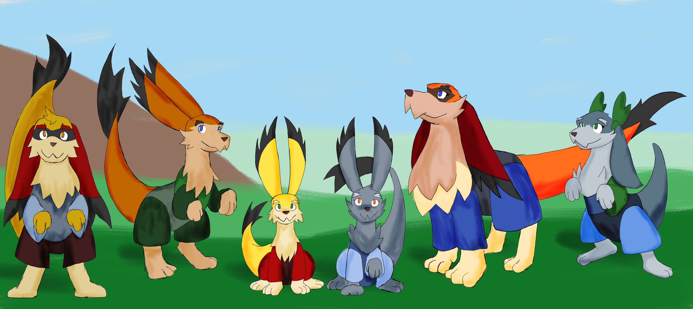

# Rowlf

In the World of Threa, there are 21 races. This is a description of the Rowlf, a race that lives in the world of Threa.

---

---

## Appearance

The Rowlf appearance can be mistaken for a canine animal. They are quadrupeds with four-fingered paws. They have thick tails and floppy ears, which end in a tuft of black fur. Their bodies are covered in fur with a variety of colors and patterns. Their eye colors can be blues, greens, and oranges.

They wear clothing that is unique to quadrupedal bodies. Their vocal range is limited—for example, they are unable to pronounce the letter "I". As such, they prefer writing to communicate, carrying a chalkboard with them.

---

## Society

### Population Categories

The Rowlf have no nation or society of themselves to speak of. They do the best they can wherever they are. There are three broad populations determined by how they interact with other races.

**Commoners:** The largest population. Not much different than any other race, but they can be considered second-class citizens. Their animal appearance and inability to communicate effectively make it hard for them to assert themselves. If they are wronged, they take the loss and move on. They may also find themselves dependent on others to perform tasks that are harder to perform for a quadruped.

**Pets:** They are effectively slaves, owned by some master and used for tasks that would otherwise be done by a beast of burden. Of particular note are those who serve as pets, like a dog. They live with some degree of luxury but subservient to their master.

**Wilds:** They basically live out in the wild, outside any society or norm. Organized as packs, similar to wolves. They hunt, live in caves and burrows. Every so often they may need to trade with other races for things like tools and clothing.

### Pets and Identity

Rowlf that are held as pets may find it hard to transition to either of the two other populations. For one, they are being cared for, like how someone cares for a horse or a cat. Their owner makes all arrangements for their well-being, so when they find themselves without an owner, they really don't know what to do to take care of themselves.

An interesting note: when their owner gives them a name they themselves are unable to pronounce, it creates a profound identity problem. For example, the name "Fifi" is unpronounceable for a Rowlf, leaving them unable to even introduce themselves.

An ownerless pet may shed their unpronounceable name for a new one, but this is a hard step to make since it would basically discard their old identity. It is easy if their life as a pet was full of hardship, but if they were a loved pet of the family, they may not be ready to discard that part of themselves just yet—especially if their owner's family had prestige.

### Names and Pronunciation

Rowlf names are a singular personal name, two syllables long. Examples include: Roro, Roru, Rofu, Mufu, Grufo, and Lulu.

The first vowel determines if it's a male or female name:
- **O** for male names
- **U** for female names

Pets are named by their owners, so they may not follow this convention. In fact, they may receive names that a Rowlf cannot pronounce, such as Max, Bella, or Fifi.

**Sounds Rowlf cannot replicate:**
- Vowels: A, I
- Consonants: B, C, D, K, P, Q, V, W, X

---

## Mechanics and Movement

### Upright Posture

Rowlf can stand on their hind legs and perform most tasks. They can use tools and their weapon standing up. They can only use their chalkboard with their hands, as they cannot handle chalk with their mouths. They can get jobs where mobility limitations are manageable, such as using a footstool to reach a countertop.

### Quadrupedal Posture

On all fours, they have increased mobility and agility. They can walk, run, swim, jump, climb, and move faster and with greater ease than when standing up.

They attach their curved knives and chalkboards to their hind legs for easy access and can reach with their mouths. They may also attach tools to their arms for quick access.

### Communication and Tools

Rowlf typically carry both a chalkboard and a curved knife secured on each of their hind legs when commoners or wilds. Pets do not carry either item.

---

## Weapons

### Curved Knife

The curved knife, also called Tooth is the weapon of choice for the Rowlf. The limited dexterity from their paws makes it hard to handle weapons and tools with finesse. Instead, they use their mouths to grip their weapons and tools. The curved knife is the best weapon they can use when gripped by their mouths.

Wilds use it quite effectively for hunting. It is not uncommon for Rowlf to carry a curved knife secured on their hind leg for easy access.

### Tooth

**Type:** Tooth — Weapon of choice of the Rowlf

**Description:** [WIP]

| Variant         | Slash | Pierce | Blunt | Reach | Speed | Defense | Wield    | Effects |
|-----------------|-------|--------|-------|-------|-------|---------|----------|---------|
| Jrrn (Horn)     |       |        |       |       |       |         | One-Hand |         |
| Ff-ng (Fang)    |       |        |       |       |       |         | One-Hand |         |
| Tss-g (Tusk)    |       |        |       |       |       |         | One-Hand |         |
| T-lnn (Talon)   |       |        |       |       |       |         | One-Hand |         |
| On-tlr (Antler) |       |        |       |       |       |         | One-Hand |         |
| St-ng (Sting)   |       |        |       |       |       |         | One-Hand |         |
| M-gss (Beak)    |       |        |       |       |       |         | One-Hand |         |
| Rrrm (Ram)      |       |        |       |       |       |         | One-Hand |         |
| T-grr (Dagger)  |       |        |       |       |       |         | One-Hand |         |

**Components:** [WIP]

**Variant Descriptions:** [WIP]

**Additional Notes:** [WIP]

---

## Narrative: The Picnic and the Hunt

A noble family went out to a picnic on the lavish lawn of their estate. The coach stopped to let the family out: the gentleman of the house, his wife, their three children, and their pet, a Rowlf named Fifi. As the wife and some servants were setting up the picnic, the children played with Fifi.

Once the food was ready, the children ran to their mother's call. Fifi, exhausted from playing with the children, went and laid down next to her owner, the gentleman. She stretched for a bit. The gentleman gently petted Fifi on her head as they contemplated the family getting ready to eat. The gentleman joined them, leaving Fifi lounging on the grass.

Some moments later, at the edge of the estate, a deer rushed through the bushes, running for its life, as a Rowlf was chasing it. The family watched from the top of the hill as the chase unfolded, and so did Fifi. The deer zigged and zagged, trying to shake off its pursuer. But the Rowlf was able to soon run right by its side. With a swift slash from his curved knife, the deer fell. The Rowlf then grabbed some rope, getting ready to strap the deer on his back.

"Halt!" said the gentleman in a firm, thunderous voice. The Rowlf heard him and approached the gentleman humbly.

"This is my land. As such, that is my deer," said the gentleman.

Unintelligible words escaped the Rowlf's mouth in protest: "Eh mm hun tt" (It's my hunt). The Rowlf proceeded to grab his chalkboard, but the gentleman raised his hand, halting him.

"I'll give you two coins for the deer." This shocked the Rowlf, but then he lowered his ears. He can't argue. The servants grabbed the deer, and the Rowlf reluctantly took the coins.

"Very well. Off you go."

The Rowlf proceeded to head out. Fifi and the Rowlf exchanged looks. Fifi was perplexed. The gentleman gave a few gentle pats to Fifi on her head.

"Did that ruffian terrify you? Don't be. You are not a savage like one of those."

Fifi kept looking at the Rowlf as he exited the estate. When he jumped through the bushes, unseen.

### Narrative Notes

Fifi, being a luxurious pet, has only met other Rowlfs who are also pets. The wild Rowlf is the first time she sees one. One thing that surprised her is that the gentleman was talking to the Rowlf like a person—while not as equals, he treated the Rowlf with enough intelligence for an economic exchange, and halted him from speaking. While the gentleman is kind toward Fifi, he treats her as not intelligent. She was perplexed, not terrified.

Fifi herself has never spoken; she has had no real need to. In a future scene, after Fifi has run away, she comes across the wild Rowlf. He asks for her name. He gives his as "Rofu." When Fifi tries to speak, she is unable to—she can only say "ff ff."

Also, the two coins are below the value of the deer.

### Narrative Development: The Child Variant

**Alternative Development with Child:**

Rofu started the hunt way outside the estate, but his child kept stumbling, missing with slashes. Eventually, the deer ran into the estate. Rofu knew he was in trouble, so he cut the lesson short and went for the kill himself. He had hoped that no one had seen him and could take the deer out as soon as possible, but they were seen.

When the gentleman halts him, Rofu says: "Eh ur hun tt" (It's our hunt). The child says: "mm hun tt" (my hunt).

When the gentleman offers the two coins, the child stomps on the ground, flares his ears, and starts growling: "No Frrrr" (No Fair). Then Rofu hisses at the child. The child drops his stance and looks up at his father. Rofu tilts his head, telling his child to leave: "Ljj" (Leave). The child hesitates. Rofu hisses again, then the child leaves. The gentleman says, "Listen to your papa," as the child runs back to the hedges. Then Rofu lowers his ears and accepts the two coins.

**Design Notes on This Variant:**

This variant keeps the story focused between Fifi, Rofu, and the gentleman while introducing the teaching element of the hunt and the father-child dynamic. Fifi would notice the child peeking through the hedges. The inclusion of the child adds depth to Rofu's character—showing restraint and authority despite his frustration at the situation.

---

## Meta

### Design Philosophy

The Rowlf were designed as a race that exists in the margins of society—quadrupeds in a world built for bipeds. This creates inherent communication and mobility limitations that force them into specific social niches. The three populations (Commoners, Pets, Wilds) represent different adaptive strategies to this constraint.

The pet dynamic is particularly significant because it creates a complex relationship with identity and autonomy. A pet given an unpronounceable name experiences an existential limitation—they cannot even name themselves. This serves as both a practical consequence of their vocal limitations and a metaphor for the loss of agency that comes with servitude.

The naming convention (first vowel determining gender, two syllables) reflects a consistent phonetic system that marks them as distinctly "other" while remaining pronounceable by other races (mostly—hence the negotiation around names like "Fifi").

### Narrative Inspiration

The picnic scene explores the intersection of these three populations through a single moment: Fifi (Pet) witnessing Rofu (Wild) being treated with economic respect but not social equality by the Gentleman (authority figure). It's a moment of cognitive dissonance for Fifi, who has never heard a Rowlf speak, and realizes that her "savage" cousins are more than she has been led to believe.

The variant with the child deepens this by showing the transmission of culture and survival skills within the Wilds, even as external authority (the Gentleman) disrupts that teaching moment. Rofu's choice to silence his child demonstrates his understanding of power dynamics—he knows he cannot win this confrontation.

---