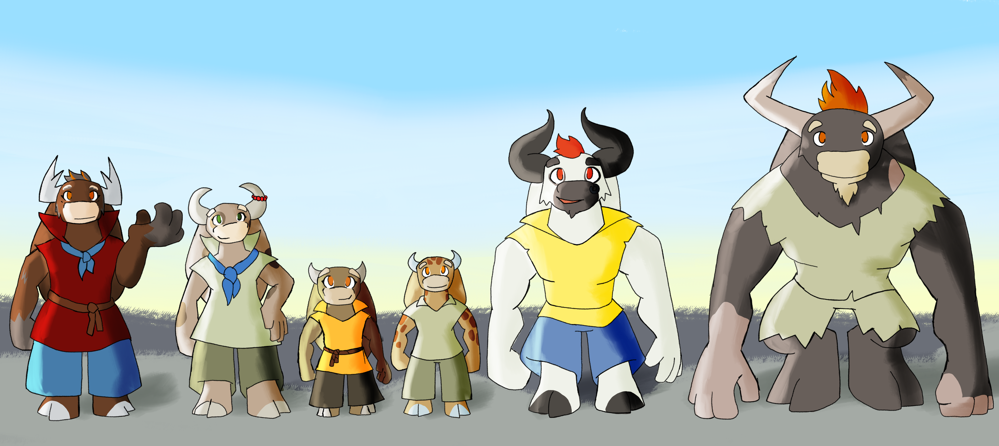

# Zeur

In the World of Threa, there are 21 races. This is a description of the Zeur, a race that lives in the world of Threa.

---

---

## Appearance

The Zeur are a matriarchal mercantile people. Males are the property and labor of females.

On their physical appearance, of Primal form, they have features of bovine and hoofed creatures. Their skin is covered in fine fur with a wide variety of patterns. They have orange eyes, box snouts, and four-finger hands. They have two hoofed, digitigrade feet. They possess a muscular build with broad shoulders. They have horns that can resemble those of cows, bulls, or deer. They have long, floppy ears and a short tail with a tuft of hair.

When they are young, there isn't much difference between males and females, with females being slightly taller. Beginning in their late teens, males start growing much larger. Females tend to average 4.5 feet tall. Males can peak at 7 feet tall. When they reach about 30 years old, males start to hunch and use their arms to support their weight, eventually walking on all fours. At this point, they are no longer viable to start a family.

---

## Society

### Overview

The Zeur are a stateless, matriarchal mercantile people. They have no nation of their own and no territory. They live among the other races, embedded within established communities. Their business prowess makes them valuable in the communities where they settle. The Boss is the owner-operator of her business-family, which may take the form of a shop, cafeteria, transport service, mining operation, or any other business endeavor.

### Family Structure

A typical family unit consists of the Boss female, Wife female, multiple Husband males, a Prize male, and the children of the Boss and Prize. 

**The Boss** is the head of the household and owner-operator of the business.

**The Wife** is the main partner and companion for the Boss. She deals with administration and service of the business. The Boss-Wife marriage is the one that receives a ceremony. While it could be strictly business, they are often romantic partners, with courtship and couple stages. The Boss may develop romantic feelings with any of her husbands, though not usually for the Prize. He is more to show off the Boss's status.

**Husbands** are one or more males purchased at auction from their mothers. They provide the labor for the business. Having two husbands is considered successful, with more well-off families having up to five or six husbands. The Boss's marriages with her husbands are transactional, they occur when she purchases them.

**The Prize** is one husband who will be the father of the Boss's children. Prizes are young males, purchased between ages 20 and 25. They are considered handsome and are often pampered and displayed by their boss. They are at their most expensive and bring a good amount of money at auction.

**Children** are the offspring of the Boss and Prize, cared for by the Wife. Any male children will eventually be sold at auction as husbands or prizes.

### Alternative Family Configurations

While the full family unit above is standard, other configurations exist:

**Boss and one Husband:** Since at least one husband is needed for labor, the lone husband would be the father of the Boss's children (as long as he is younger than 30). Older husbands are cheaper but at their peak strength, making this a good start for a poor Zeur family-business.

**Boss and Wife:** This setup is good for clerical or administrative business, basically jobs that are not physically demanding. This setup is also more romantic. Later in their life, they may acquire a husband or a prize to start a family.

**Boss, Wife, and Husband (no Prize):** Prizes are young and very expensive. The boss may not indulge in such a luxurious expense. She would use a husband for her children, as long as he is younger than 30 years.

**Boss, Wife, and Prize:** After a long life together, a boss and her wife may decide to buy a prize as an indulgence.

**Boss and Prize:** This is rare and indicates that the Boss comes from a rich family, as she was able to afford a prize as her first purchase. The prize, being young, is a very good purchase as he has many years to remain viable.

**Multiple Prizes:** Having multiple prizes indicates incredible wealth. Being able to buy multiple young male Zeur is a very expensive endeavor. Prizes start at age 20, still growing yet to reach their peak strength at age 30. Each one is highly viable for the family-business.

### Boss and Wife Dynamics

During courtship, the couple has no distinctions between Boss and Wife. These are established at the wedding. Typically, the more assertive and aggressive becomes the Boss, while the more passive and submissive becomes the Wife. However, this can also arise from mutual agreement, resulting in the passive one being the Boss and the aggressive one being the Wife. It is also possible that both are equally passive or equally aggressive.

If two Bosses wed (both already having a business and/or family), one must submit to the other and become the Wife. In this wedding-merger, the Boss assumes ownership of the Wife's husbands and children.

Typically, the Boss bears the children of the family. In some families, the Wife bears children. In rare instances, both do.

Typically, it is the Prize that fathers the children. However, any husband younger than 30 years can father children. In some instances, this happens if time is running out, their husband is about to turn 30, and they don't see themselves ever purchasing a prize.

### Stigma and Social Notes

Buying a first husband past age 30 carries stigma. While the husband can be used to start a family and is at his peak strength, he has few years left as useful labor. There is also stigma for the mother unable to sell her son until such a late age, as it reflects badly on her and her family's standing.

---

## Life Stages

### Male Zeur Life Stages

**Birth to 15 years:**
When they are children, they are slightly smaller than female children. If the family has a Wife, she cares for him; otherwise, the Boss does. They are well kept and pampered.

**15 to 20 years:**
At about age 15, males start growing larger than females. Their muscles begin to bulk up. At this point, the Boss takes interest in their care if they were previously cared for by the Wife. The Boss ensures they continue to grow big and strong.

**20 to 25 years:**
At age 20, their mother (the Boss) begins to sell them. This can be informal, simply approaching another female Zeur and asking if she would purchase their son, or at a seasonal market auction, where multiple mothers gather to sell their sons and bosses gather to buy them.

If purchased between ages 20 and 25, they are bought as Prizes. They have youthful looks and are considered handsome. Their bosses have the longest time to start a family with them. Their bosses would pamper them, display them, and may limit their labor if they can afford to do so. They are at their most expensive and would bring a good amount of money.

**25 to 30 years:**
If sold between ages 25 and 30, they are sold as Husbands. They have a few years left to start a family and still plenty of years for labor. At this point, they have reached their peak height, about 7 to 8 feet tall. Their muscles still continue to bulk up, though they have yet to reach their peak muscle bulk. They don't fetch the high price they would have when younger. It is at this point that they start to be used as labor, if they weren't already. They also receive their last set of good clothing, as they have finished getting taller.

**30 to 35+ years:**
After 30, they are no longer desirable for family purposes. They start to hunch over and transition to walking on all fours. Their value decreases significantly, though some may still be purchased as labor. Eventually, they become too infirm to be useful and may be retired or cared for by their family of origin if they're still valued.

Once sold, they belong to their bosses. Their mothers, their family of origin, have no claim on them. While their mothers and family may see them as a prized possession, they may also have familial sentiment as a son and brother, making the sale a somber moment as they may never see each other again.

While unsold and past age 20, males remain with their mothers and serve their mother's family-business as labor, though on a limited basis, as their mothers would not want their son to suffer injury, risking a potential sale.

### Female Zeur Life Stages

**Birth to 15 years:**
Females are slightly larger than male Zeur children. The Wife, if there is one, cares for them; otherwise, the Boss does. Unlike boys, girls receive education, focusing on math and literacy. As soon as they can, they help with administrative tasks and chores for the family business, especially if it is a lone boss with no wife.

**15 to 20 years:**
Their education and work continue. A key aspect during this time is that they can start dating and courtship. They may form couples, break up, or form lasting bonds. While the emotional and romantic aspect is important, they also assess the business capabilities of their potential future partner.

**20 to 25 years:**
This is a crucial point in their lives, as the decisions here have a profound impact. She basically has three options: start a relationship, a business, or a family.

*Pursuing marriage:* She may continue to pursue a meaningful relationship with their girlfriend and end up marrying them. If they pursue this at this time, business and family would come later in life.

*Pursuing business:* She may continue to be employed with their mother or seek employment elsewhere. If they choose to start a business, they would purchase a husband. They may focus on establishing their business before having a relationship or starting a family.

*Pursuing family:* If they focus on starting a family first, they may purchase a young husband or even a prize. However, this is more for affluent females, as they can afford to delay their own business or have a meaningful relationship.

**25 to 35 years:**
At this point, they would be expected to be well established, depending on their early decisions.

*If they pursued marriage:* They have a strong emotional foundation with their partner and more experience together to start their business. They may have saved a fair amount of money and might get a young husband, multiple older husbands, or even a prize. They are well positioned to start both a business and a family.

*If they started their business young:* Perhaps by buying a cheap older husband, they may have experienced many failed ventures, as they were alone with little experience (males are not educated in business and cannot really provide much support). Nonetheless, they may have developed romantic feelings for their husband. If they have been successful at this point, they may pursue a relationship, start a family, or continue to develop their business and get another husband.

*If they chose family first:* They are in a great position. Their husbands are ready to work, having already fathered her children. She can transition them to start her business and may get a Wife to care for her children.

---

## Business and Culture

### Common Business Ventures

A common business venture Zeur family-businesses engage in involves earthworks: digging, mining, demolition, and other opportunities.

### The Pickhammer

The Pickhammer is a common tool the Zeur possess, used to facilitate various earthwork tasks. A Zeur Pickhammer is a sack filled with heavy bulk material. One end is flat and blunt, the other end is sharpened to a point. It has leather straps for ease of use. Because of the size difference, males and females wield a Pickhammer differently. A female uses both hands to wield and maneuver. For a male Zeur, they are strapped to their hands like brass knuckles. The Pickhammer is also useful for bolstering the safety and security of the family.

#### Pickhammer Variants

| Variant | Slash | Pierce | Blunt     | Reach | Speed | Defense | Wield    | Effects                                                                                                  |
|---------|-------|--------|-----------|-------|-------|---------|----------|----------------------------------------------------------------------------------------------------------|
| Base    | None  | Weak   | Great     | Low   | Low   | Great   | Two-Hand | Splash on Heavy                                                                                          |
| Slaker  | None  | None   | Good      | Low   | Fair  | Fair    | Two-Hand | Splash on Shatter                                                                                        |
| Puncher | None  | Good   | Great     | Low   | Low   | Great   | Two-Hand | Splash on Heavy; +Breach                                                                                 |
| Slammer | None  | High   | High      | Great | Fair  | Fair    | Two-Hand | Splash on Heavy; +Stagger                                                                                |
| Thumper | None  | Fair   | High      | Fair  | Low   | Great   | Two-Hand | Splash on Strike; Knockback on Heavy; Breach on Charge                                                   |
| Breaker | None  | Great  | Excellent | Good  | Fair  | Great   | Two-Hand | Splash on Strike; Unblockable Charge, Breach on Charge; Stagger on Splash; Unblockable Splash on Shatter |

#### Pickhammer Components

- **Bulk:** The main mass of the weapon.
- **Cover:** Thick fabrics that protect the Bulk.
- **Padding:** Extra-thick fabrics at the blunt striking surface.
- **Tip Cap:** A solid tip at the piercing end.
- **Harness:** Used to hold and maneuver the weapon. It functions as a weapon sheath, negates volume, and enables quick equip.
- **Filler:** Used instead of, or alongside, the Bulk.
- **Frame:** Provides structure to the Cover.
- **Case:** Adds additional structure to the Cover.

#### Pickhammer Variant Descriptions

**Base:** Solid mass covered in heavy fabrics.

**Slaker:** A sack filled with loose material (e.g., sand, rocks, rubble). Can be used as a pack.

**Puncher:** The tapered point is reinforced.

**Slammer:** The harness can be detached, allowing the Pickhammer to be swung with a partial detachment.

**Thumper:** An inner frame adds strength and durability to the weapon.

**Breaker:** A solid inner case, strong frame, and a fillable compartment.

#### Pickhammer Notes

- The durability of a Pickhammer is lower than that of other weapons.
- The Frame and Case add durability.
- The Reach for the Slammer and Breaker are for when the harness is partially attached. If fully attached, the value for both is Fair.
- The Speed for the Slammer and Breaker are for when the harness is partially attached. If fully attached, the value for both is Fair.
- Can produce effects on Shatter, not on breakage.
- Male Zeur can dual-wield Pickhammers.
- Male Zeur can dual-wield all two-handed weapons.
- Male Zeur have difficulty wielding one-handed weapons.

#### Pickhammer as Tool and Weapon

Pickhammers are used as civilian tools. The main function is to break rocks as earth movers. The Puncher makes a good pick, and the Thumper makes a good hammer. However, the investment is not in durability, as that would add weight. While Zeur can carry that weight, it is an investment of time, material, and skill to cast a single solid object. The Pickhammer is more like a refillable hammer, the frame provides durability on the impacting surfaces, while the mass is refillable. On breaking, the frame is recovered, the cover is replaced, and it is filled back up with whatever mass: dirt, sand, gravel. Manufacture, repair, and even tuning are inexpensive, but this comes at the cost of durability and makes it somewhat odd to wield.

The Pickhammer can also be used as a pack, remove the filler and fill it with your items. When not using it for work, the padding may keep your items safe. It's like using a purse, backpack, or duffel bag as a weapon.

### Clothing

Zeur clothing is simple and sturdy. They use thick fabrics, like burlap, for durability. They also use ropes for ornamentation. Female clothing is well kept and made with vibrant colors. Male clothing colors are typically beige, brown, and off-white. Male clothing also tends to be in tatters, except for the Prize husband and male children. Their clothing exhibits similar care and colors as female garments.

### The Gossip Network

Because of their mercantile organization, there are Zeur that travel. They keep the culture alive through what functions as a gossip network. A local Zeur may get together with a traveling one and gossip about the happenings of the area, especially of other Zeur. When the traveling Zeur leaves for another town, she gossips about the first one as well. So along with their merchant network, there is a gossip network that keeps everyone connected.

### Auctions

Part of that connection is facilitated through auctions. There is always one each year on the day of the highest sun (Summer Solstice). The gossip network organizes where it will take place. Mothers take their sons to show them off and sell. They can sell at any time of the year, and there may be smaller impromptu auctions as well. Plus, there are other festivities, once again facilitated by the gossip network.

In a big city, an auction may be organized by a Zeur shop, more likely an earthwork shop since they have space. It is not necessarily a public event, it isn't their kingdom; they are doing their own thing. Perhaps it's a summer harvest festival, celebrating their kings, or just another day. The Gossip Network informs Zeur from nearby towns of the event.

**Example gossip exchange:**

"Ania said she is hosting this year, you don't say! Well, you know how she enjoys her tea. I know a tea supplier; I may bring a sample to Ania. Maybe she would give me a discount on her eldest. You know, this will be my son's debut. He is so strong and handsome. Are you sure you don't need an extra pair of hands? Yours looks like his hands are about to fall. Either way, best bring your wallet to Ania's!"

---

## Case Study: Karin and Rina

Karin married Rina, with Karin being the Boss and Rina her Wife. They started a restaurant. The restaurant struggled at the beginning, but soon it started to boom. A few years later, Rina left Karin and took most of their savings. This devastated Karin. At this point, Karin wanted a husband, but could only afford a 35-year-old Tau, too old to start a family, but he was strong, kind, and loyal. She married (purchased) Tau. He was used to expand her business into shipping, in addition to shipping supplies to her restaurant. She ended up hiring two non-Zeur to help with the restaurant. Her shipping business with Tau took off.

Some years later, Karin and Tau went to pick up delivered goods to a shop. It turns out that Rina was running that shop by herself. Karin was furious at her for stealing and leaving. Rina apologized and begged for forgiveness. Rina told Karin that to improve the restaurant business, she made a few bets, she gambled to raise money. However, she got into a lot of debt, and collectors were about to go after Karin and the restaurant. So Rina stole the money to pay off the debt and then fled. Eventually, they patched things up and remarried (merger). To show her appreciation, Rina bought Mikke, a prize, for Karin. Mikke is young, impulsive, conceited, and brash. Still, Karin pampered him. While Mikke was aggressive toward Tau, Karin made it clear to him that Tau was more precious to her than Mikke. Eventually, Mikke fathered a child with Karin, a girl named Jaysie.

---

## Meta

### Design Philosophy

The initial explorative idea revolved around feminism and women's struggles. Specifically: "What would be masculinism?" Instead of a women-oppressed dynamic, a men-oppressed one. But in a way that does not feminize men, nor masculinize women, at least not too much. This brought in the male menopause concept, the limited procreate ability that is natural in women. In real-life patriarchal societies, there is culture around female fertility, even assigning monetary value. The same concept applies here but in reverse, with men's fertility and strength being the scarce, valued resource. This was partly inspired by domestic animals, especially the turkey that cannot naturally procreate without human interference. The male Zeur's growth pattern and physical decline is the cause of their limited fertility windows.

The bovine aspect actually comes from their name. In the broader Destiny Saga conceptualization, this race embodies strength and power. Zeus is a nice image of power, and Zeus turned himself into a bull, for which the constellation of Taurus is a representation. Thus, Zeur is a portmanteau of Zeus and Taurus. The visual design continues with the Taurus look.

### Naming Conventions

Names are designed to allude to complex scientific terms, specifically atomic science. Tau is the most obvious (the Tau Lepton). Ania alludes to Anion (the negatively charged ion). Karin and Rina both allude to Neutrino. Mikke comes from Muon. The concept is that since their conceptual design revolves around strength and the stereotypical strong but not-so-intelligent person, their names should sound smart, a reversal of expectation. Similar to the Simpsons' joke of a muscular action character named Melvin Eugene Punymeyer.

---